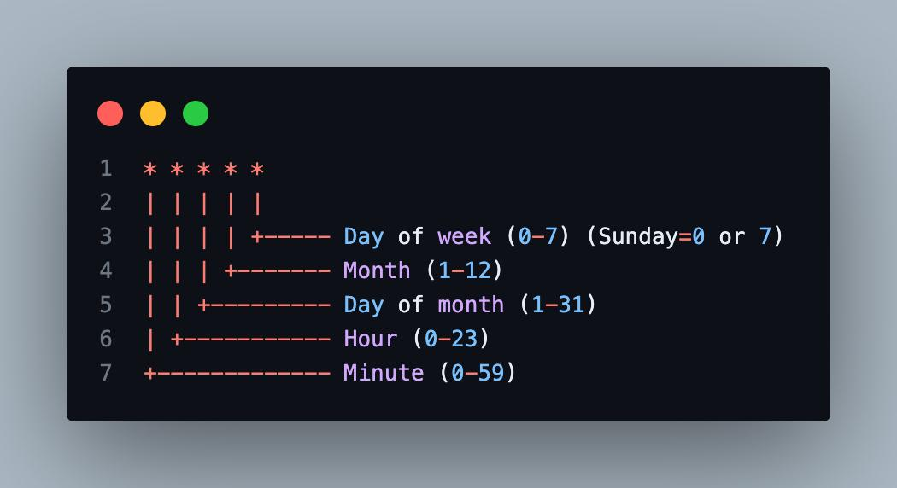

<p align="center">

</p>

<p align="center">
<a href="https://pub.dev/packages/ui_guard"></a>
<a href="https://github.com/Tanvirul-swe/ui_guard/actions"></a>
<a href="https://github.com/Tanvirul-swe/ui_guard"></a>
<a href="https://flutter.dev/docs/development/data-and-backend/state-mgmt/options#bloc--rx"></a>
</p>

<p align="center"> <strong>Widgets that make role, permission, and condition-based UI control <em>simple, scalable,</em> and <em>secure</em>.</strong><br> Built entirely in Dart to help you build smarter, access-aware Flutter apps. </p> <p align="center"> <em>✨ ui_guard works seamlessly with any role management logic or state management approach.</em> </p>

## 🔐 Why use ui_guard?

In many apps, you need to control access to certain parts of your UI:

- Show settings only to admins
- Render upgrade buttons for guests
- Show/hide widgets based on subscription level
- Schedule-based UI control like a cron job style

`ui_guard` lets you do this easily and declaratively — using only Dart.

---

## ✨ Features

- ✅ Guard widgets or entire screens based on roles
- 🧩 Combine roles, permissions, and runtime conditions
- 🧪 Developer override mode for UI testing
- 🔄 Easily update roles at runtime
- 📦 Pure Dart — no platform dependencies
- ♻️ Works with any state management
- ⏰ Time-based UI control using cron-style schedules
- ⚡ Reactive guard updates with `GuardNotifier`
- 🧾 Access diagnostics via `AccessDecision`
- 🧩 Reusable named authorization policies with `AccessPolicy` + `PolicyGuard`
- 🌍 Advanced cron support (`*/5`, `MON-FRI`, `@daily`) with optional UTC mode

---

## 📦 Installation

Add this to your `pubspec.yaml`:

```yaml
dependencies:
  ui_guard: ^1.1.0
```


## 🧠 Core API

A simple class to store and manage the current user's roles.

#### 🔹 Guard
A simple class to store and manage the current user's roles.
```dart
final guard = Guard();
guard.setUserRoles(['admin']); // Set roles for current user

print(guard.currentRoles); // ['admin']
```

#### 🔹 AccessGuard
Renders content conditionally based on required roles.

```dart
AccessGuard(
  guard: guard,
  requiredRoles: ['admin'],
  builder: (_) => const Text('Admin Panel'),
  fallbackBuilder: (_) => const Text('Access Denied'),
);
```

#### 🔹 RoleBasedView
Use when you want to show/hide a single widget inline.

```dart
RoleBasedView(
  guard: guard,
  requiredRoles: ['admin', 'moderator'],
  child: const Text('Admin & Moderator Content'),
  fallback: const Text('You do not have permission to view this content.'),
);
```

#### 🔹 RoleGuard
Utility class with common access logic:

```dart
RoleGuard.hasAnyRole(['admin'], ['admin', 'user']); // true
RoleGuard.hasAllRoles(['admin', 'editor'], ['admin']); // true
```

#### 🧪 Developer Override Mode
Bypass all restrictions during development or testing:

```dart
class GuardConfig {
  static bool developerOverrideEnabled = true; // Use in dev only
}
```

#### 🧮 Combined Access Conditions
Create advanced rules using roles, permissions, and runtime checks:

```dart
CombinedGuard(
  guard: guard,
  requiredRoles: ['manager'],
  requiredPermissions: ['edit_team'],
  condition: () => organization.isInternalMode,
  builder: (_) => const TeamEditor(),
  fallbackBuilder: (_) => const Text('Access Restricted'),
);

```

#### ⏱️ Timed Access Control

Use `TimedAccessGuard` to control UI visibility based on time. Ideal for:

- 🎁 Limited-time offers & flash sales
- 🧪 Beta or trial feature access
- 🔧 Maintenance or downtime notices
- 📅 Event-specific content
- 🛍️ Daily/weekly deals
- 📢 Time-based announcements
- 🏢 Business-hour-only features

```dart
TimedAccessGuard(
  start: DateTime(2025, 7, 18, 9),
  end: DateTime(2025, 7, 18, 13),
  checkInterval: Duration(seconds: 1),
  onTimeUpdate: (remaining) {
    debugPrint("⏱️ Time left: ${remaining.inSeconds}s");
  },
  builder: (_) => PromoBanner(), // Active content
  fallbackBuilder: (_) => SizedBox.shrink(), // Hidden or fallback
),

```

#### 🕒 ScheduleGuard

A widget that shows or hides its content based on a cron-style schedule (e.g., business hours, weekly timing).

##### 🧠 How It Works
Supports cron syntax with 5 fields:

 


- Automatically re-evaluates every minute or custom interval via checkInterval.
- Invalid cron formats display a helpful error message.

##### Use Cases of `ScheduleGuard`
- 🕘 Time-gate access to features (e.g. booking, chat, forms)
- 🏷️ Show banners during flash sales or promotional hours
- 🛠️ Hide UI during maintenance or blackout windows
- ⏰ Enable actions only during working/business hours
- 📢 Display reminders or alerts at scheduled times

```dart
ScheduleGuard(
  schedule: "0 9 * * 1-5", // Every weekday at 9:00 AM
  builder: (_) => Text("Business is open!"),
  fallbackBuilder: (_) => Text("Closed right now."),
)

```

## 🆕 New in v1.1.0

### Reactive access updates
```dart
final guard = GuardNotifier();

AccessGuard(
  guard: guard,
  rebuildListenable: guard,
  requiredRoles: const ['admin'],
  builder: (_) => const Text('Admin'),
)
```

### Reusable policies
```dart
const manageUsersPolicy = AccessPolicy(
  name: 'manage_users',
  requiredRoles: ['admin'],
  requiredPermissions: ['users.edit'],
);

PolicyGuard(
  guard: guard,
  policy: manageUsersPolicy,
  rebuildListenable: guard,
  builder: (_) => const Text('User Manager'),
  fallbackBuilder: (_) => const Text('No Access'),
);
```

### Decision diagnostics
```dart
CombinedGuard(
  guard: guard,
  requiredRoles: const ['manager'],
  onDecision: (decision) {
    if (!decision.allowed) {
      debugPrint('Missing roles: ${decision.missingRoles}');
    }
  },
  builder: (_) => const Text('Manager Area'),
)
```

### Advanced schedules
```dart
ScheduleGuard(
  schedule: '*/15 9-17 * * MON-FRI',
  useUtc: true,
  builder: (_) => const Text('Business hours in UTC'),
)
```

## 📱 Example App
Explore the full working example in the [`/example`](example) directory.

## 🧩 Use Cases

Here are some common scenarios where `ui_guard` is useful:

| Use Case                  | Example                                         |
|---------------------------|------------------------------------------------|
| Admin-only screens        | `requiredRoles: ['admin']`                      |
| Feature restrictions      | Hide paid features from free users              |
| Auth state UI             | Show "Login" or "Logout" buttons based on roles|
| Nested permissions        | Show moderator tools for `['moderator', 'admin']` roles |
| Read-only vs edit access  | Conditionally render buttons or fields          |
| Subscription tiers        | Control access with `['free', 'premium', 'pro']` roles |
| Combined logic            | Use roles + permissions + runtime conditions |
| Developer override	      | Skip restrictions in development or test |
| Time-based access 	      | Display banners or UI only within a defined time range `TimedAccessGuard` |
| Scheduled access          | Control UI visibility based on cron-style schedules using `ScheduleGuard` |


## 🚀 CI/CD & Auto Publish

This repository includes GitHub Actions workflows:

- `CI` (`.github/workflows/ci.yml`) runs format, analyze, and test checks.
- `Publish to pub.dev` (`.github/workflows/publish.yml`) publishes automatically on GitHub Release publish.

To enable publishing, configure pub.dev Trusted Publisher for this GitHub repository and use a protected `pub.dev` environment in GitHub.

Follow `RELEASING.md` before creating the GitHub Release.

## 💬 Contributing

Contributions are welcome!

- <a href="https://github.com/Tanvirul-swe/ui_guard" target="_blank">🌐 GitHub</a>
- <a href="https://github.com/Tanvirul-swe/ui_guard/issues" target="_blank">🐛 Issues</a>


To contribute:

1. Fork the repository
2. Create a new branch
3. Commit your changes
4. Submit a pull request


## 🛠️ Dart SDK Version

This package requires Dart SDK version **>=3.0.0**.

Please ensure your Flutter and Dart versions meet this requirement.

---

## ☕ Support My Work

If you find `ui_guard` helpful, consider supporting me!

[](https://coff.ee/tanvir_swe)

Prefer mobile? Scan the QR code below to support me directly:

<p align="center">
  
</p>


## 👤 Maintainers

- MD. TANVIRUL ISLAM
